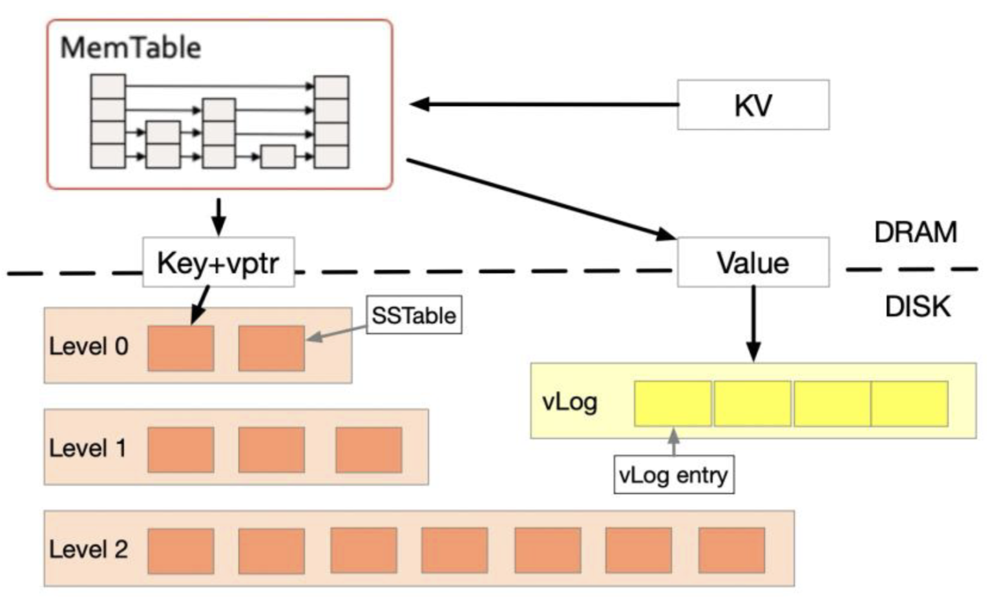

## Project LSM-KV: KVStore using Log-structured Merge Tree


The handout files include two main parts:

- The `KVStoreAPI` class in `kvstore_api.h` that specifies the interface of KVStore.
- Test files including correctness test (`correctness.cc`) and persistence test (`persistence.cc`).

Explanation of each file:

```text
.
├── Makefile  // Makefile if you use GNU Make
├── README.md // This readme file
├── data      // Data directory
├── doc       // Pdf in Chinese
├── Dockerfile // (could have some problem with fallocate function, better use a real Linux machine)
└── src
    ├── bloomfilter
    ├── kvstore
    │   ├── kvstore_api.h  // KVStoreAPI
    │   ├── kvstore.cc  
    │   └── kvstore.h 
    ├── skiplist
    │   ├── skiplist.cc  
    │   └── skiplist.h 
    ├── sstable
    │   ├── sstable.cc  
    │   └── sstable.h 
    ├── tests
    │   ├── correctness.cc // Correctness test, you should not modify this file 
    │   ├── persistence.cc // Persistence test, you should not modify this file
    │   └── test.h         // Base class for testing, you should not modify this file
    ├── utils
    │   ├── MurmurHash3.h  // Provides murmur3 hash function
    │   └── utils.h         // Provides some file/directory interface
    └── vlog
        ├── MurmurHash3.h  // Provides murmur3 hash function
        └── utils.h         // Provides some file/directory interface

```

### Overview
Here is the the architechture of this KVStore system.



It mainly consists of three part:
- MemTable in memory, implemented with skiplist.
- SSTables on disk, including headers, bloomfilters, keys and offsets.
- VLog on disk, storing values.

### Multi records on the same key
Suppose we have two record, A(key1, value1), B(key1, value2). And I divide my storage system into following hierarchy
- skiplist
- level-0
- level-x (x > 0)

if A and B appeared in different classes, we assert updated order as: $$skiplist > level_0 > level_x$$

if A and B both appeared in level-0, their belonging sstables must have different timestamps.

if A and B both appeared in level-x, note sstables in the same level x don't intersect, and therefore the upper level (smaller index) record always win.
(compation always push down the oldest sstables, the only exception is when there are several equally oldest timestamps, the sstable with the smallest key is chosen, but since these same timestamp tables don't intersect in their keys, so we don't need to consider them with regard to records with the same key)

### Basic operations
PUT(Key, Value)
```pseudo
if key already exists in memTable then
    update value
    return

if memtable is full then
    flush memtable to disk(write vlog, generate sstable)
    compaction()

insert new pair to skiplist
```
GET(Key)
```pseudo
if key exists in memTable then
    return value

for i = 0 to maxLevel do
    for sstables in level-i do
        // notice, level-0 should compare on timestamp
        if key exists in filter then
            if binary search found key then
                value := lookupVlog()
                return value

return "Don't exists"
```
DEL(Key)
```pseudo
if GET(Key) not found then
    return false
else
    PUT(Key, "~DELETED~")
# Notice no need for writing "~DELETED~" into vlog, just set vlen=0
# In last level compaction, record with vlen=0 should be thrown away
```
SCAN(K1, K2), return a `std::list<K, V>`
```pseudo
```
RESET()
- rm sstables and level dir
- rm vlog
- rm memtable and cache

KVStore()
- lookup sstables, build up cache
- restore head and tail for vlog
    - head: file size
    - tail: after hole, find magic, crc pass

~KVStore()
- flush memtalbe

GC(chunk_size)
1) scan the first n vlog entries untill recycled bytes >= chunk_size,
check entry.key and see does the newest record still points to 
the same offset?
2) if it does, insert back to memory table.
3) if it doesn't, ignore.
4) just flush
5) use `de_alloc_file()` to dig holes on file

### About docker
- You can create multiple containers based on the same Docker image.
---
- First launch Docker desktop
- list all containers `docker ps -a`
- list all image `docker images`
- build an image based on DockerFile (in . directory)`docker build -t lsmkv_image .`
- create container `docker create -t -i --privileged --name lsmkv -v $(pwd):/home/stu/LSMKV lsmkv_image bash`
- start container `docker start -a -i lsmkv`
- git rm --cached
